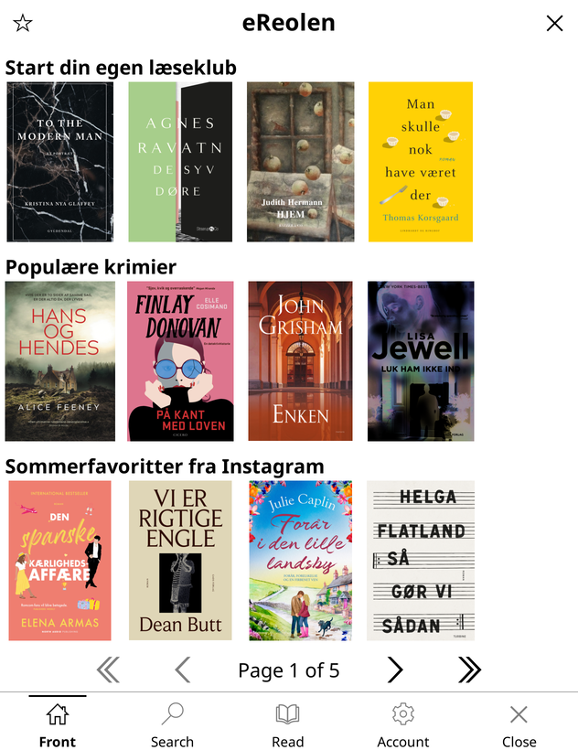
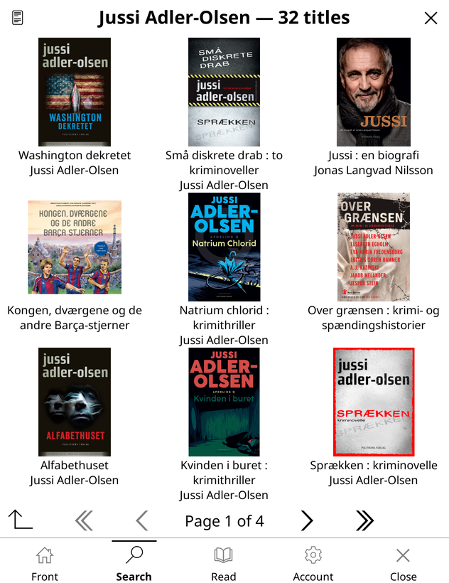
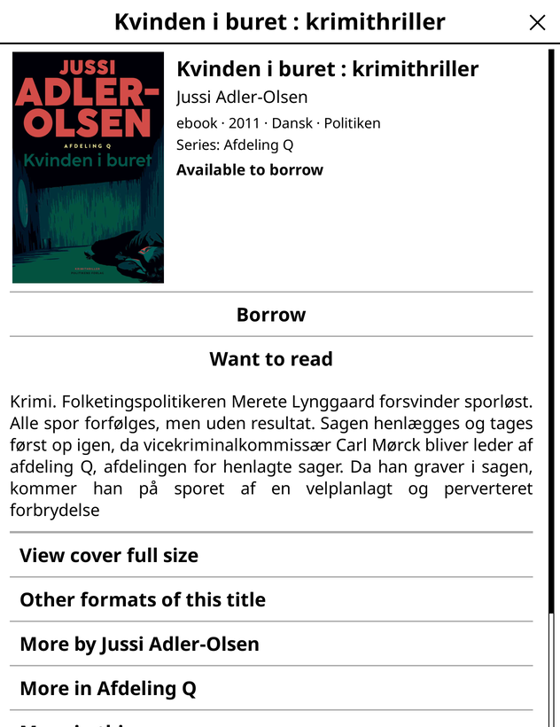
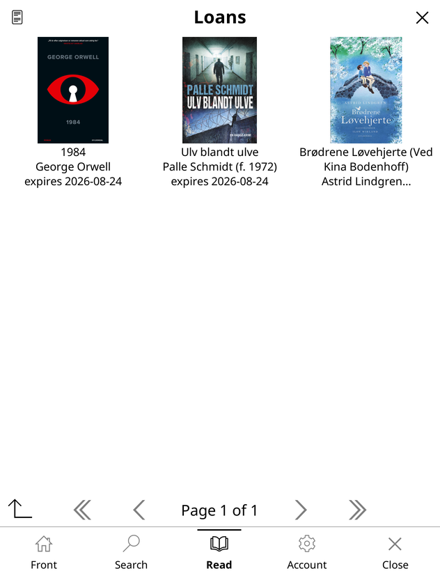

# ereolen.koplugin

Borrow and read books from [eReolen](https://ereolen.dk) — the Danish public
libraries' e-book service — without leaving KOReader.

|  |  |
|---|---|
|  |  |
| The front page, with the same editorial shelves the eReolen app shows. | Search results, cover-first. |
|  |  |
| A title: blurb, availability, and the ways into related books. | Your loans, with return dates. |

<sub>Screenshots from the KOReader desktop emulator at Kobo Libra geometry. On a
greyscale e-reader the covers are, of course, grey.</sub>

## What it does

- **Browse** the app's own front page — 13 editorial shelves — and its 25
  curated categories.
- **Search** the catalogue, with suggestions and facets.
- **Titles** show the blurb, format, availability and series, plus more by the
  same author, more in the series, other formats and reviews.
- **Borrow** a title, reserve one that is out, or add it to your want-to-read
  list.
- **Account**: loans, reservations, checklist, loan history, library profile.
- **Download** a loan and hand it straight to the reader.

## What you need

- A library card and PIN from a Danish public library.
- **An ACSM handler for ebooks.** eReolen never serves the book itself — an
  ebook loan yields an Adobe ACSM ticket that has to be redeemed and decrypted.
  [acsm.koplugin](https://github.com/kaikozlov/acsm.koplugin) does both; any
  plugin that registers a provider for `.acsm` will do. Audiobooks are a direct
  download and need nothing extra.

The Kobo build targets KOReader 2026.03; the screenshots above are 2026.07 on
the desktop.

## Install

The plugin ships a compiled Lua C module, so grab the build for the machine that
will run it.

**Kobo**

```sh
nix build .#kobo
scp -r result/ereolen.koplugin kobo:/mnt/onboard/.adds/koreader/plugins/
```

**Desktop**

```sh
nix build
cp -rL result/ereolen.koplugin ~/.config/koreader/plugins/
```

Then restart KOReader and open the main menu → the search tab → **eReolen
catalog**. The first run asks for your library, card number and PIN; they are
stored in KOReader's settings.

## How it is put together

The Lua here is the interface. Everything that talks to eReolen's JSON-RPC API
lives in [ereolenWrapper](https://github.com/xdHampus/ereolenWrapper), a C++
library that this plugin loads as `lib/libereolenwrapper.so` — the only place
KOReader's plugin loader looks for a C module.

The browse layer is the exception: front page and categories come from a public
JSON blob on Firebase, the same one the official app reads, cached locally and
refreshed only when its generation changes.

## Known gaps

- **The front page is empty on a fresh install.** Search → Browse categories is
  the only thing that populates the shared-content cache, and the Front tab only
  picks it up the next time the catalog is opened. There is no way to force a
  refresh.
- Reservations and loan history are plain lists, not the cover grid the rest of
  the app uses.
- Removing a title from loan history is not wired up.

## License

GPL-3.0 — see [LICENSE](LICENSE).
